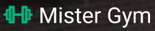
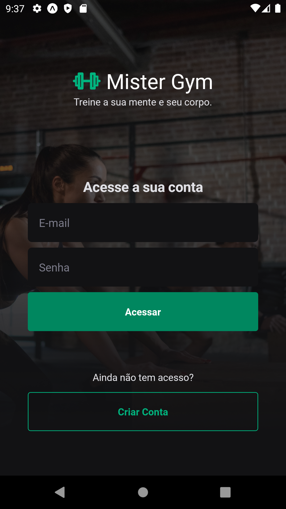
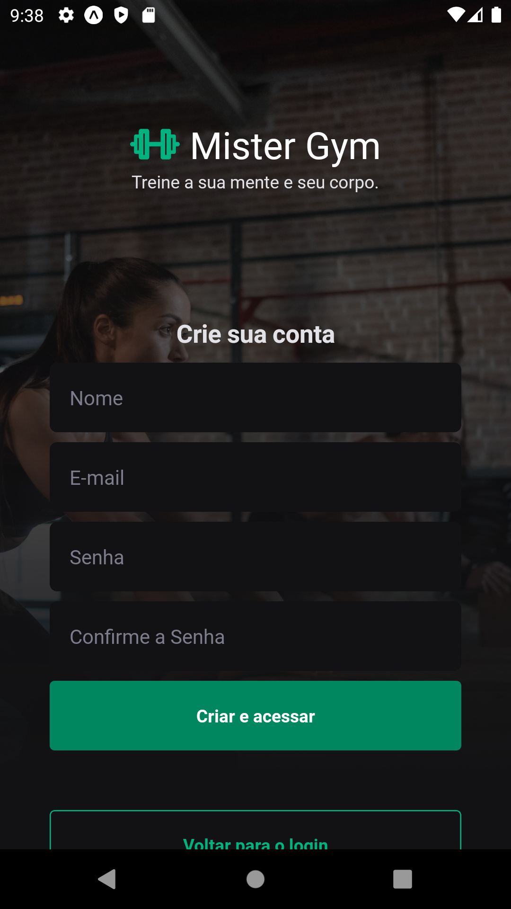
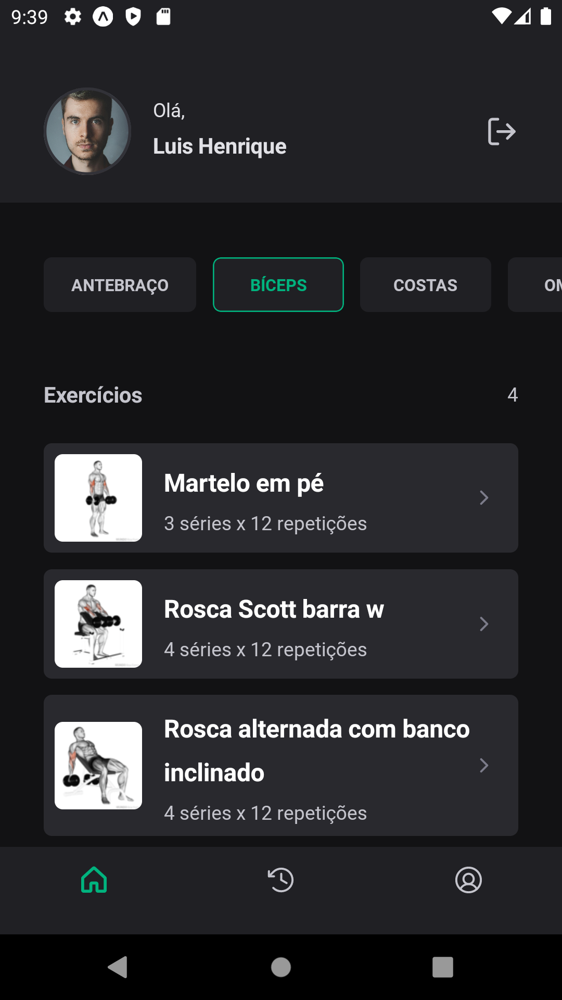
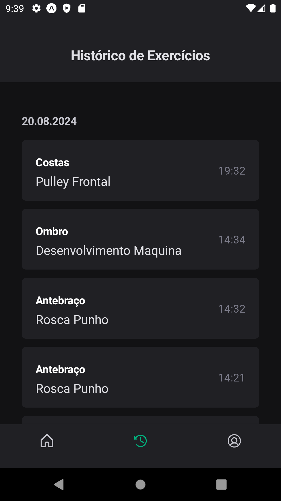
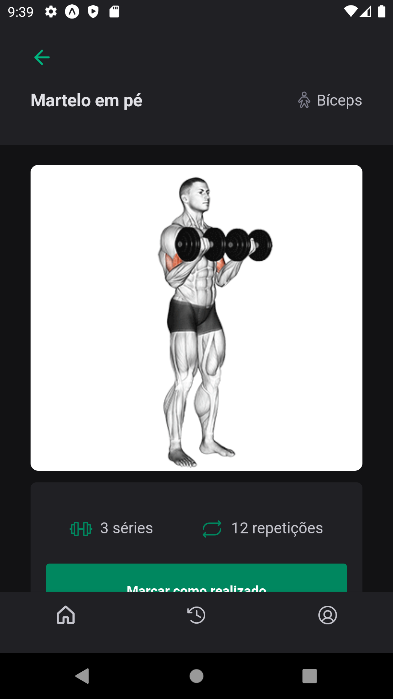

<h1 align="center">
  
</h1>

<h3 align="center">
  MisterGym - An app to manage your exercises
</h3>

<h1 align="center">
  
  
  
  
  <imgwidth="200px" height="350px"src=".github/Screenshot_5.png" alt="Profile">
  
</h1>

<p align="center">
  

  <a href="https://www.linkedin.com/in/luishng/">
    
  </a>

  

  <a href="https://github.com/luishng/MisterGym/commits/main">
    
  </a>

  <a href="https://github.com/luishng/MisterGym/issues">
    
  </a>

  
</p>

# :pushpin: Table of Contents

<p align="center">
  <a href="#recycle-about-the-project">About the project</a>&nbsp;&nbsp;&nbsp;|&nbsp;&nbsp;&nbsp;
  <a href="#-technologies">Technologies</a>&nbsp;&nbsp;&nbsp;|&nbsp;&nbsp;&nbsp;
  <a href="#-getting-started">Getting Started</a>&nbsp;&nbsp;&nbsp;|&nbsp;&nbsp;&nbsp;
  <a href="#-features">Features</a>&nbsp;&nbsp;&nbsp;|&nbsp;&nbsp;&nbsp;
  <a href="#-license">License</a>
</p>

## 🏋🏽💪🏼 About the project

This project was developed on the Ignite by [Rocketseat](https://rocketseat.com.br/) &nbsp;🚀

This software a mobile hybrid application, provide a way for the people control your gym exercises.

## 🚀 Technologies

**Language:**

- [TypeScript](https://www.typescriptlang.org/)

**Mobile:**

- [React Native](https://reactnative.dev/) - React programming paradigm
- [Expo](https://docs.expo.io/) - Framework
- [React Hook Form](https://react-hook-form.com/) - Form Controller
- [React Navigation (v6)](https://reactnavigation.org/) - Router
- [Axios](https://axios-http.com/) - HTTP Client
- [Gluestack](https://gluestack.io/) - "Tailwind in RN"
- [Lucide](https://lucide.dev/) - Free Icons
- [Yup](https://www.npmjs.com/package/yup) - Form Validation

## 🔗 Features

- List of exercises for each body part;
- Exercises details;
- Mark exercises as done;
- Exercises history of days;
- User profile;

## 🏁 Getting Started

**Install the requirements**

- [Git](https://git-scm.com/)
- [Node.js](https://nodejs.org/en/)
- [Yarn](https://classic.yarnpkg.com/) or [npm](https://www.npmjs.com/)
- [React Native](https://reactnative.dev/)
- [Expo](https://docs.expo.io/)

**Clone Back-End project and access the folder**

```bash
$ git clone https://github.com/luishng/MisterGym-api.git && cd MisterGym-api
```

```bash
# Install the dependencies
$ npm i

# Start the client
$ npn run start
```

**_Let the backend running and use the Mobile Project!_**

**Clone Mobile project and access the folder**

```bash
$ git clone https://github.com/luishng/MisterGym.git && cd MisterGym
```

```bash
# Install the dependencies
$ npm i

# Start the client
$ expo start
```

## 📝 License

This project is licensed under the MIT License - see the [LICENSE](LICENSE) file for details.

---

Made with 💜&nbsp; by [Luis Henrique](https://github.com/luishng) 👋 &nbsp;[See my linkedin](https://www.linkedin.com/in/luishng/) 👷
